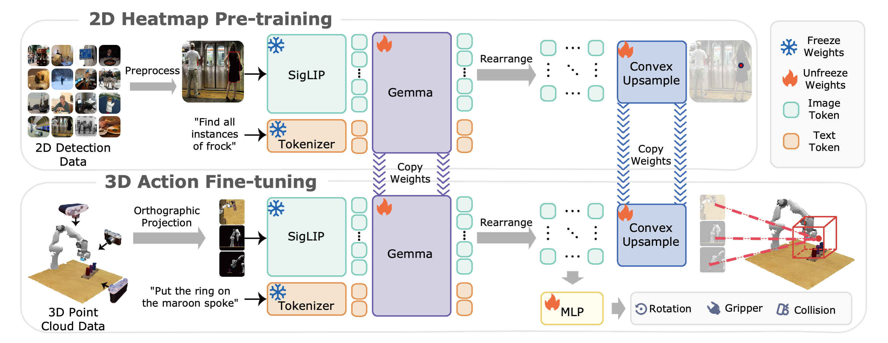

<div align="center">

# BridgeVLA: Input-Output Alignment for Efficient 3D Manipulation Learning with Vision-Language Models

A 3D VLA framework that aligns the input and output within a shared 2D space in both pre-training and fine-tuning, enabling strong data efficiency and achieves impressive performance in both basic and generalization settings.

🏆 COLOSSEUM Challenge Champion @ CVPR 2025 GRAIL Workshop

[\[📄Paper\]](https://arxiv.org/abs/2506.07961)  [\[🏠Project Page\]](https://bridgevla.github.io/)  [\[📊Dataset\]](https://huggingface.co/datasets/LPY/BridgeVLA)  [\[🤗Checkpoints\]](https://huggingface.co/datasets/LPY/BridgeVLA)


</div>


## 🔥 News
* **`2025.06.15`** 🌟 We are proud to introduce BridgeVLA, a model designed to bridge the gap between VLM backbone and VLA by aligning input and output within a shared 2D space during both pre-training and fine-tuning.

## 👀 Contents

- [Model Overview](#Model-Overview)
- [Installation](#Installation)
- [Training](#Training)
- [Evaluation](#evaluation)
- [Experimental Results](#experimental-results)
- [TODO](#TODO)
- [Acknowledgement](#Acknowledgement)
- [Contact](#Contact)
- [Citation](#Citation)


## 📋 Model Overview
As illustrated in the following figure, BridgeVLA employs a dual-phase training recipe. During pre-training, it is trained to predict 2D heatmaps on object detection datasets. During fine-tuning, point clouds are projected into multiple 2D images as inputs to the VLM backbone. The model is trained to predict 2D heatmaps for estimating the translational action and other action components. **This design aligns the input and output within a shared 2D space in both pre-training and fine-tuning.**

## 🛠️ Installation
1. **Clone this repository and navigate to the BridgeVLA folder:**
```bash
git clone https://github.com/BridgeVLA/BridgeVLA.git
cd BridgeVLA
```

2. **Install the required package:**
```bash
conda create -n bridgevla python=3.9 -y
conda activate bridgevla

# For pre-training
cd pretrain
bash ./pretrain_install.sh

# For RLBench fine-tuning
cd finetune/RLBench
bash ./install_rlbench.sh

# For Colosseum fine-tuning
cd finetune/Colosseum
bash ./install_colosseum.sh

# For GemBench fine-tuning
cd finetune/GemBench
bash ./install_gembench.sh
```
3. Note: To avoid potential conflicts between different simulation benchmarks, we suggest creating separate virtual environments for each benchmark. Also, our model is built upon [Paligemma](https://huggingface.co/google/paligemma-3b-pt-224), which is a gated repo. Therefore, you should first be authenticated to access it.
## 🚀 Training
If you want to reproduce our results, please use the same training hyperparameters in the config file. **Do not forget to modify the corresponding saving path in the file before running the following code.**
1. **Pre-training:**
We use the object detection data in the RoboPoint dataset to pre-train the model. We upload the data and checkpoints [here](https://huggingface.co/datasets/LPY/BridgeVLA/tree/main/). With the `pretrain/pretrain.py` file, you can do three things:
* `visualiztion`: This function is used to visualize the pre-training dataset.
* `pre-training`: This function is used to pre-train the Paligemma model on the dataset .
* `evaluation`: This function is used to test the pre-trained checkpoints.
What you need to do is to modify the checking branch in the file and then run the following code:
```bash
cd pretrain
bash pretrain.sh --branches BRANCH_OPTION --config_path PATH_TO_CONFIG_FILE --json_detection_path PATH_TO_DETECTION_JSON --image_folder PATH_TO_IMAGE_FOLDER
```
2. **RLBench Fine-tuning:** To finetune on RLBench, you should first prepare the dataset. You can generate the train and test data yourself by following the instructions in [PerAct repository](https://github.com/peract/peract?tab=readme-ov-file#data-generation). Or you can directly download the dataset we generate to fully reproduce our results [here](https://huggingface.co/datasets/LPY/BridgeVLA_RLBench_TRAIN_DATA/tree/main). To improve the data loading speed, we will first convert the raw data into replay buffer. The training code will automatically do that if it does not find the replay buffer. Meanwhile, you can also directly download the replay buffer we preprocess [here](https://huggingface.co/datasets/LPY/BridgeVLA_RLBench_TRAIN_BUFFER/tree/main). After the data is ready, you can use the `finetune/RLBench/train.sh` file to finetune the model. Please run the following code:
```bash
cd finetune/RLBench
bash train.sh --exp_cfg_path  configs/rlbench_config.yaml \
              --exp_note debug \
              --freeze_vision_tower \
              --log_dir PATH_TO_LOG_DIR \
              --load_pretrain \
              --pretrain_path  PATH_TO_PRETRAINED_MODEL 
```
3. **COLOSSEUM Fine-tuning:** For COLOSSEUM, we fine-tune the model with the training dataset provided by the [COLOSSEUM challenge](https://huggingface.co/datasets/colosseum/colosseum-challenge/tree/main). Similarly, our training code will first convert the raw data into replay buffer. You can also directly download the replay buffer we preprocess [here](https://huggingface.co/datasets/LPY/BridgeVLA_COLOSSEUM_TRAIN_BUFFER/tree/main). Then, you can use the `finetune/Colosseum/train.sh` file to finetune the model. Please run the following code:
```bash
cd finetune/Colosseum
bash train.sh --exp_cfg_path  configs/colosseum_config.yaml \
              --exp_note debug \
              --freeze_vision_tower \
              --log_dir PATH_TO_LOG_DIR \
              --load_pretrain \
              --pretrain_path  PATH_TO_PRETRAINED_MODEL
```
4. **GemBench Fine-tuning:** To finetune on GemBench, you should first download the dataset from [here](https://huggingface.co/datasets/rjgpinel/GEMBench/tree/main). The structure of GemBench is different from RLBench and COLOSSEUM. We did not use replay buffer and did not do demo augmentation. You can use the `finetune/GemBench/train.sh` file to finetune the model. Please run the following code:
```bash
cd finetune/GemBench
bash train.sh --exp_cfg_path  configs/gembench_config.yaml \
              --exp_note debug \
              --freeze_vision_tower \
              --log_dir PATH_TO_LOG_DIR \
              --load_pretrain \
              --pretrain_path  PATH_TO_PRETRAINED_MODEL
```
## 🧪 Evaluation
1. **RLBench Evaluation:** To evaluate on RLBench, you can just run the following code:
```bash
cd finetune/RLBench
bash eval.sh # Please modify the evaluated tasks and the checkpoint path in the file.
```
2. **COLOSSEUM Evaluation:** To evaluate on COLOSSEUM, you should first preprocess the eval data as the original format is not suitable for our data loading. Run the following code to preprocess them. Or you can directly download the cleaned data we have tided from [here](https://huggingface.co/datasets/LPY/BridgeVLA_COLOSSUM_EVAL_DATA/tree/main).
```bash
cd finetune/Colosseum
python3   cleanup_script.py   /PATH/TO/COLOSSEUM_EVAL_DATA/
```
After cleaning the eval dataset, you can run the following code to evaluate the model:
```bash
cd finetune/Colosseum
bash eval.sh  VARIATION LOG_NAME MODEL_EPOCH MODEL_FOLDER
```

COLOSSEUM requires to evaluate on all the variation factors. We provide the  `Colosseum/cal_statics.py` to compute the per task success rate on each variation factor. Just replace the results folder path in the file and run the following code:
```bash
cd finetune/Colosseum
python3 cal_statics.py
```
Note: During the evaluation of Variations 1 and 6, three tasks—“close laptop lid,” “wipe desk,” and “insert onto peg”—occasionally encountered errors in certain evaluation episodes. These issues stem from problems within the evaluation data itself. I have contacted the COLOSSEUM authors, who have confirmed the issue and plan to address it in a future update. In the meantime, I adopted the following workaround: I recorded only the successful trials and repeated the evaluation until I had collected 25 successful runs for each of these tasks. These 25 valid trials were then used to compute the final performance metrics.

3. **GemBench Evaluation:** To evaluate on GemBench, you should first launch the server. Run the following code:
```bash
cd finetune/GemBench
bash run_server.sh  MODEL_EPOCH  MODEL_BASE_PATH
```
After lanuching the server, you can run the following code to evaluate the model:
```bash
cd finetune/GemBench
bash run_client.sh  SEED MODEL_EPOCH
```
The results are saved as `results.json`, which record the success status of each trial. We provide the `GemBench/cal_results.py` to compute the average success rates of each task in each setting for each seed. Just replace the results folder path in the file and run the following code:
```bash
cd finetune/GemBench
python3 cal_results.py
```
## 📈 Experimental Results
BridgeVLA's performance on three simulation benchmarks is shown in the following table:
### RLBench Task Success Rates (Part 1)

| Model                          | Avg. Success (%) ↑ | Avg. Rank ↓ | Close Jar      | Drag Stick     | Insert Peg     | Meat off Grill | Open Drawer    | Place Cups     | Place Wine     | Push Buttons   |
|--------------------------------|--------------------|-------------|----------------|----------------|----------------|----------------|----------------|----------------|----------------|----------------|
| Image-BC (CNN)                 | 1.3                | 9.3         | 0.0            | 0.0            | 0.0            | 0.0            | 0.0            | 4.0            | 0.0            | 0.0            |
| Image-BC (ViT)                 | 1.3                | 9.7         | 0.0            | 0.0            | 0.0            | 0.0            | 0.0            | 0.0            | 0.0            | 0.0            |
| C2F-ARM-BC                     | 20.1               | 8.7         | 24.0           | 24.0           | 4.0            | 20.0           | 20.0           | 0.0            | 8.0            | 72.0           |
| HiveFormer                     | 45.3               | 6.9         | 52.0           | 76.0           | 0.0            | **100.0**      | 52.0           | 0.0            | 80.0           | 84.0           |
| PolarNet                       | 46.4               | 6.5         | 36.0           | 92.0           | 4.0            | **100.0**      | 84.0           | 0.0            | 40.0           | 96.0           |
| PerAct                         | 49.4               | 6.3         | 55.2±4.7       | 89.6±4.1       | 5.6±4.1        | 70.4±2.0       | 88.0±5.7       | 2.4±3.2        | 44.8±7.8       | 92.8±3.0       |
| Act3D                          | 65.0               | 4.3         | 92.0           | 92.0           | 27.0           | 94.0           | 93.0           | 3.0            | 80.0           | 99.0           |
| RVT                            | 62.9               | 4.4         | 52.0±2.5       | 99.2±1.6       | 11.2±3.0       | 88.0±2.5       | 71.2±6.9       | 4.0±2.5        | 91.0±5.2       | **100.0±0.0**  |
| 3D Diffuser Actor              | 81.3               | 2.5         | 96.0±2.5       | **100.0±0.0**  | 65.6±4.1       | 96.8±1.6       | 89.6±4.1       | 24.0±7.6       | 93.6±4.8       | 98.4±2.0       |
| RVT-2                          | 81.4               | 2.5         | **100.0±0.0**  | 99.0±1.7       | 40.0±0.0       | 99.0±1.7       | 74.0±11.8      | 38.0±4.5       | **95.0±3.3**   | **100.0±0.0**  |
| **BridgeVLA (Ours)**           | **88.2**           | **1.9**     | **100.0±0.0**  | **100.0±0.0**  | **88.0±2.8**   | **100.0±0.0**  | **100.0±0.0**  | **58.4±10.0**  | 88.0±2.8       | 98.4±2.2       |

### RLBench Task Success Rates (Part 2)

| Model                          | Put in Cupboard   | Put in Drawer    | Put in Safe      | Screw Bulb      | Slide Block     | Sort Shape      | Stack Blocks    | Stack Cups      | Sweep to Dustpan | Turn Tap        |
|--------------------------------|-------------------|------------------|------------------|-----------------|-----------------|-----------------|-----------------|------------------|------------------|-----------------|
| Image-BC (CNN)                 | 0.0               | 8.0              | 4.0              | 0.0             | 0.0             | 0.0             | 0.0             | 0.0              | 0.0              | 8.0             |
| Image-BC (ViT)                 | 0.0               | 0.0              | 0.0              | 0.0             | 0.0             | 0.0             | 0.0             | 0.0              | 0.0              | 16.0            |
| C2F-ARM-BC                     | 0.0               | 4.0              | 12.0             | 8.0             | 16.0            | 8.0             | 0.0             | 0.0              | 0.0              | 68.0            |
| HiveFormer                     | 32.0              | 68.0             | 76.0             | 8.0             | 64.0            | 8.0             | 8.0             | 0.0              | 28.0             | 80.0            |
| PolarNet                       | 12.0              | 32.0             | 84.0             | 44.0            | 56.0            | 12.0            | 4.0             | 8.0              | 52.0             | 80.0            |
| PerAct                         | 28.0±4.4          | 51.2±4.7         | 84.0±3.6         | 17.6±2.0        | 74.0±13.0       | 16.8±4.7        | 26.4±3.2        | 2.4±2.0          | 52.0±0.0         | 88.0±4.4        |
| Act3D                          | 51.0              | 90.0             | 95.0             | 47.0            | 93.0            | 8.0             | 12.0            | 9.0              | 92.0             | 94.0            |
| RVT                            | 49.6±3.2          | 88.0±5.7         | 91.2±3.0         | 48.0±5.7        | 81.6±5.4        | 36.0±2.5        | 28.8±3.9        | 26.4±8.2         | 72.0±0.0         | 93.6±4.1        |
| 3D Diffuser Actor              | **85.6±4.1**      | 96.0±3.6         | 97.6±2.0         | 82.4±2.0        | **97.6±3.2**    | 44.0±4.4        | 68.3±3.3        | 47.2±8.5         | 84.0±4.4         | **99.2±1.6**    |
| RVT-2                          | 66.0±4.5          | 96.0±0.0         | 96.0±2.8         | **88.0±4.9**    | 92.0±2.8        | 35.0±7.1        | **80.0±2.8**    | 69.0±5.9         | **100.0±0.0**   | 99.0±1.7        |
| **BridgeVLA (Ours)**           | 73.6±4.6          | **99.2±1.8**     | **99.2±1.8**     | 87.2±6.6        | 96.0±2.8        | **60.8±7.7**    | 76.8±8.7        | **81.6±3.6**     | 87.2±1.8         | 92.8±3.3        |

### COLOSSEUM Task Success Rates (Part 1)

| Models                  | Average ↑ | Avg. Rank ↓ | All Perturbations      | MO-COLOR          | RO-COLOR          | MO-TEXTURE        | RO-TEXTURE        | MO-SIZE          |
|-------------------------|-----------|-------------|------------------------|-------------------|-------------------|-------------------|-------------------|------------------|
| R3M-MLP                 | 0.8       | 5.71        | 0.6                   | 0.4              | 0.0               | 0.0               | 0.0              | 1.8             |
| MVP-MLP                 | 1.6       | 5.0         | 0.8                   | 1.2              | 0.0               | 0.4               | 0.0              | 4.44            |
| PerAct                  | 27.9      | 3.71        | 7.2                   | 24.0             | 29.2              | 28.8              | 17.71            | 35.6            |
| RVT                     | 35.4      | 3.28        | 6.4                   | 26.0             | 31.3              | 44.8              | 41.1             | 35.3            |
| RVT-2                   | 56.7      | 1.92        | 15.6 ± 0.8            | 53.0 ± 0.9       | 54.6 ± 0.6        | 59.7 ± 0.7        | 56.7 ± 1.4       | 60.9 ± 0.9      |
| **BridgeVLA (Ours)**    | **64.0**  | **1.07**    | **18.7 ± 2.2**        | **60.5 ± 1.1**   | **63.8 ± 0.1**    | **63.5 ± 1.5**    | **68.4 ± 3.3**   | **69.3 ± 1.0**  |

### COLOSSEUM Task Success Rates (Part 2)

| Models                  | RO-SIZE          | Light Color       | Table Color        | Table Texture      | Distractor         | Background Texture | RLBench          | Camera Pose      |
|-------------------------|------------------|-------------------|--------------------|--------------------|--------------------|--------------------|------------------|------------------|
| R3M-MLP                 | 0.0              | 1.0               | 1.4                | 0.2                | 1.6                | 1.2                | 2.0              | 0.8              |
| MVP-MLP                 | 0.0              | 1.6               | 1.6                | 1.0                | 3.8                | 2.2                | 2.0              | 2.6              |
| PerAct                  | 29.3             | 29.1              | 30.4               | 23.2               | 27.1               | 33.5               | 39.4             | 36.3             |
| RVT                     | 40.5             | 34.0              | 30.0               | 45.2               | 18.8               | 46.4               | 53.4             | 42.2             |
| RVT-2                   | 53.4 ± 1.5       | 58.0 ± 1.1        | 62.6 ± 0.9         | 56.6 ± 0.9         | **60.8 ± 0.5**     | 68.7 ± 1.1         | 68.8 ± 1.3       | 64.4 ± 0.5       |
| **BridgeVLA (Ours)**    | **61.7 ± 0.8**   | **69.7 ± 1.2**    | **75.7 ± 0.9**     | **71.3 ± 0.7**     | 51.8 ± 1.5         | **74.8 ± 1.0**     | **73.1 ± 0.2**   | **73.8 ± 0.3**   |

### Performance on GemBench

| Method                         | Avg.  | L1              | L2              | L3              | L4             |
|--------------------------------|-------|-----------------|-----------------|-----------------|----------------|
| Hiveformer                     | 30.4  | 60.3±1.5        | 26.1±1.4        | 35.1±1.7        | 0.0±0.0        |
| PolarNet                       | 38.4  | 77.7±0.9        | 37.1±1.4        | 38.5±1.7        | 0.1±0.2        |
| 3D diffuser actor              | 44.0  | 91.9±0.8        | 43.4±2.8        | 37.0±2.2        | 0.0±0.0        |
| RVT-2                          | 44.0  | 89.1±0.8        | 51.0±2.3        | 36.0±2.2        | 0.0±0.0        |
| 3D-LOTUS                       | 45.7  | **94.3±1.4**    | 49.9±2.2        | 38.1±1.1        | 0.3±0.3        |
| 3D-LOTUS++                     | 48.0  | 68.7±0.6        | 64.5±0.9        | 41.5±1.8        | **17.4±0.4**   |
| **BridgeVLA (Ours)**           | **50.0** | 91.1±1.1        | **65.0±1.3**    | **43.8±1.2**    | 0.0±0.0        |


## 📅 TODO 

- [x] Release the pre-training code
- [x] Release the training & evaluation code of RLBench
- [x] Release the training & evaluation code of COLOSSEUM
- [x] Release the training & evaluation code of GemBench
- [x] Release the pre-training data
- [x] Release the checkpoints
- [ ] Release a documentation for conducting real-robot experiments

</details>

## 🙏 Acknowledgement
We stand on the shoulders of giants, and our work in developing BridgeVLA has been inspired and empowered by the remarkable open source projects in the field. We would like to extend our heartfelt gratitude to each of these initiatives and their dedicated developers.
- [PerAct](https://peract.github.io/)
- [RVT-2](https://robotic-view-transformer-2.github.io/)
- [Palligemma](https://huggingface.co/blog/paligemma)
- [RLBench](https://github.com/stepjam/RLBench/tree/master)
- [GemBench](https://www.di.ens.fr/willow/research/gembench/)
- [COLOSSEUM](https://robot-colosseum.github.io/)
- [RoboPoint](https://github.com/wentaoyuan/RoboPoint)

## ✉️ Contact
If you have any questions about the code, please contact peiyan.li@cripac.ia.ac.cn.
## 📝 Citation

```bibtex
@misc{li2025bridgevla,
    title={BridgeVLA: Input-Output Alignment for Efficient 3D Manipulation Learning with Vision-Language Models},
    author={Peiyan Li and Yixiang Chen and Hongtao Wu and Xiao Ma and Xiangnan Wu and Yan Huang and Liang Wang and Tao Kong and Tieniu Tan},
    year={2025},
    eprint={2506.07961},
    archivePrefix={arXiv},
    primaryClass={cs.RO}
}
```


